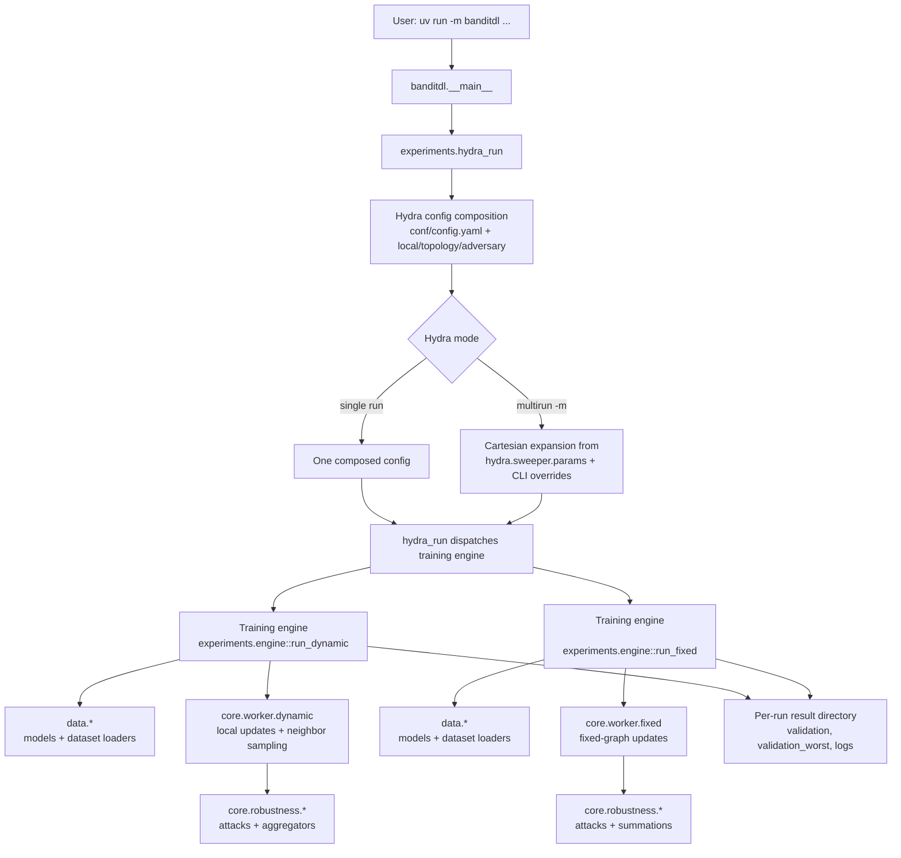
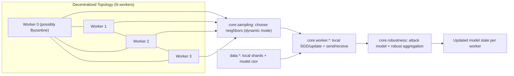

# banditdl

Hydra-multirun experiments for Byzantine-resilient decentralized learning.

## Setup

```bash
uv sync
```

If `uv` cache is not writable in your environment:

```bash
UV_CACHE_DIR=/tmp/uv-cache uv sync
```

## Run One Experiment

```bash
uv run -m banditdl
```

Example overrides:

```bash
uv run -m banditdl local=mnist topology=dynamic_uniform topology.nodes=100 topology.sampling=0.05 seed=0
```

Runs print lightweight progress to stdout: start metadata, result directory, periodic decentralized-learning rounds, evaluation accuracy when available, and completion.

## Choosing hydra config

Create a config named `override.yaml` with path `conf/override.yaml` that will be the local override of `config.yaml`, and it will be in the `.gitignore` so it won't be pushed. `override.yaml` must not be like `config.yaml`, instead its template is below:

```
defaults:
  - override local: mnist
  - override topology: dynamic_uniform
  - override adversary: none

seed: 0
device: "mps"

hydra:
  run:
    dir: .hydra_runs_override/${now:%Y-%m-%d}/${now:%H-%M-%S}
  sweep:
    dir: .hydra_multirun_override/${now:%Y-%m-%d}/${now:%H-%M-%S}
```

## Run Sweeps (Hydra Multirun)

Hydra does orchestration. The custom in-repo scheduler is no longer the main path.

## Run Sweeps (Optuna)

Use the Optuna launcher when you want Bayesian/randomized sweeps instead of Cartesian Hydra multirun:

```bash
uv run python -m banditdl.experiments.hyperparam_opt
```

Behavior:
- Starts from `conf/config.yaml` defaults.
- Loads `conf/optuna/default.yaml` and applies only sweep-target attributes listed in `optuna.search_space`.
- Runs one training trial per Optuna trial.
- Uses validation accuracy from each trial `results/validation` file as objective and selects the best trial by that metric.
- Re-runs the best trial once with a held-out test split and writes final test accuracy in `results/test`.

To customize the sweep config file:

```bash
uv run python -m banditdl.experiments.hyperparam_opt \
  --sweep-config optuna/default.yaml
```

### Ad-hoc Sweep From CLI

```bash
uv run -m banditdl -m \
  local=mnist \
  topology=dynamic_uniform \
  seed=0,1 \
  topology.nodes=50,100 \
  topology.sampling=0.03,0.05 \
  topology.neighbor_sampler=uniform,bandit \
  local.nb_local_steps=1,3
```

## Existing Config Groups

Local training:
- `mnist`
- `cifar10`

Topology/sampling:
- `dynamic_uniform`
- `dynamic_bandit`
- `fixed_cs`

Adversary:
- `none`
- `alie`

## Config Reference

Hydra config lives in `conf/`. The main entry point is `conf/config.yaml`.

Inspect the resolved config before launching a large run:

```bash
uv run -m banditdl --cfg job
```

### Top-Level Config

- `local`: local ML setup config group.
- `topology`: decentralized topology and neighbor sampling config group.
- `adversary`: Byzantine/adversarial setup config group.
- `seed`: random seed. Use comma-separated values under `-m` for sweeps.
- `device`: `auto`, `cpu`, or a torch device string such as `cuda`.

### Local Training Config

Local configs are in `conf/local/`. They describe dataset/model/optimizer-style ML parameters.

- `dataset`: dataset name passed to the loader. Common values: `mnist`, `cifar10`.
- `model`: model constructor from `banditdl/data/models.py`, for example `cnn_mnist` or `cnn_cifar_old`.
- `alpha`: Dirichlet data heterogeneity parameter passed as `dirichlet-alpha`.
- `nb_local_steps`: local SGD steps per communication round.
- `params_common`: training hyperparameters passed to the engine.

### Topology And Sampling Config

Topology configs are in `conf/topology/`.

- `mode`: topology mode. `dynamic` resamples neighbors every round. `fixed` builds one graph.
- `nodes`: total simulated participants, including Byzantine participants.
- `sampling`: dynamic-mode sampling ratio. The dynamic worker samples about `round((nodes - 1) * sampling)` neighbors.
- `degree`: fixed-mode graph degree target.
- `method`: fixed-graph summation method. Current values: `cs+`, `cs_he`, `gts`.
- `neighbor_sampler`: neighbor selection strategy. Values: `uniform`, `bandit`, `epsilon_greedy`.
- `bandit_epsilon`: epsilon-greedy exploration rate. Used by `bandit`/`epsilon_greedy`.
- `bandit_initial_value`: initial reward estimate for unseen arms.
- `bandit_reward`: reward strategy. Current value: `parameter_distance`.

### Adversary Config

Adversary configs are in `conf/adversary/`.

- `byzcount`: number of declared and real Byzantine workers currently instantiated by the Hydra adapter.
- `byzantine_budget`: robustness budget `b_hat`. If unset/null, defaults to `byzcount`.
- `attack`: Byzantine attack name or `null`. Available attacks include `SF`, `LF`, `FOE`, `ALIE`, `mimic`, `auto_ALIE`, `auto_FOE`, `inf`.

### Common Training Params

These live under `local.params_common`.

- `batch-size`: training batch size.
- `batch-size-test`: test batch size. Defaults to `100` if omitted.
- `loss`: torch loss class name, for example `NLLLoss`.
- `learning-rate`: SGD learning rate. Defaults to `0.5` if omitted.
- `learning-rate-decay`: decay scale used by the worker learning-rate schedule.
- `learning-rate-decay-delta`: step interval for learning-rate decay checks.
- `weight-decay`: SGD weight decay.
- `momentum-worker`: worker momentum.
- `nb-steps`: number of communication/training rounds.
- `evaluation-delta`: evaluate every N rounds.
- `numb-labels`: number of dataset labels.
- `pre-aggregator`: optional first-stage robust aggregation rule, commonly `nnm`.
- `aggregator`: robust aggregator, commonly `trmean`.
- `rag`: dynamic-mode robust aggregation flag. Dynamic Hydra runs force this to `true`.
- `mimic-learning-phase`: optional learning phase length for mimic attacks.
- `bucket-size`: robust aggregation bucket size. Defaults to `1`.
- `gradient-clip`: optional gradient clipping threshold.
- `server-clip`: optional server clipping flag.
- `hetero`: dataset heterogeneity flag. Defaults to `false`.
- `distinct-data`: give workers distinct local datasets. Defaults to `false`.
- `nb-datapoints`: local datapoint count for distinct-data setups.

Available robust aggregators include `average`, `trmean`, `median`, `geometric_median`, `krum`, `multi_krum`, `nnm`, `bucketing`, `pmk`, `cc`, `mda`, `mva`, `monna`, `meamed`.

### Sweep Syntax

Ad-hoc sweep:

```bash
uv run -m banditdl -m \
  local=mnist,cifar10 \
  topology=dynamic_uniform,dynamic_bandit \
  topology.nodes=50,100 \
  topology.sampling=0.03,0.05 \
  adversary=none \
  seed=0,1,2
```

Hydra takes the Cartesian product of comma-separated override values.

## How To Create A New Experiment

1. Add or copy a config in `conf/local/`, `conf/topology/`, or `conf/adversary/`.
2. Compose them from the CLI with Hydra overrides.

Example:

```yaml
# conf/topology/my_bandit.yaml
mode: dynamic
nodes: 100
sampling: 0.05
neighbor_sampler: bandit
bandit_epsilon: 0.1
bandit_initial_value: 0.0
bandit_reward: parameter_distance
```

Run it:

```bash
uv run -m banditdl local=mnist topology=my_bandit adversary=none
```

## Plot Saved Results

Each Hydra run writes artifacts directly in its run folder:
- `<hydra_run>/results/`: raw metrics and arrays (`validation`, `validation_worst`, `test` (optional), `*.npy`).
- `<hydra_run>/plots/`: auto-generated plots for all supported metrics.

Example run folder:

```text
.hydra_runs_override/2026-05-05/12-26-01/
  .hydra/
  hydra_run.log
  results/
  plots/
```

Plotting logic now lives in `banditdl/utils/plotting.py`. The script `scripts/plot_results.py` remains as a thin offline CLI wrapper around that helper.

Plot one run:

```bash
uv run python scripts/plot_results.py \
  .hydra_runs_override/<date>/<time>/results \
  -o .hydra_runs_override/<date>/<time>/plots/example.png
```

Compare multiple runs:

```bash
uv run python scripts/plot_results.py \
  .hydra_runs_override/<date>/<time-a>/results \
  .hydra_runs_override/<date>/<time-b>/results \
  --label uniform \
  --label bandit \
  -o comparison.png
```

Aggregate seed runs:

```bash
uv run python scripts/plot_results.py \
  .hydra_runs_override/<date>/*/results \
  --aggregate \
  --label "uniform mean" \
  -o uniform_seed_mean.png
```

Useful options:
- `--metric accuracies`: plot from `accuracies.npy` (default).
- `--metric validation`: plot average accuracy from `validation`.
- `--metric validation_worst`: plot worst-worker accuracy from `validation_worst`.
- `--metric test`: plot held-out test accuracy from `test` (single final point when available).
- `--metric eval|eval_worst`: legacy aliases for older run folders.
- `--metric regret`: plot regret against the best fixed neighbor subset in hindsight.
- `--metric normalized_regret`: plot regret divided by oracle reward.
- `--metric reward_algorithm|reward_oracle`: plot cumulative reward curves.
- `--metric neighbor_disagreement`: plot mean/median/max neighbor disagreement over rounds.
- `--metric consensus_drift`: plot mean/median/max drift from the global average model.
- `--stat mean|worst`: choose mean worker or worst worker; for regret, worst means highest regret.
- `--legend outside|best|none`: choose legend placement; default keeps it below the plot.
- `--max-label-length 48`: cap auto-generated labels.

## Runtime Architecture

This section describes runtime execution logic and module interactions.

### Runtime Interaction Diagram



### End-to-end Flow

1. You run `uv run -m banditdl ...`.
2. `banditdl.__main__` dispatches to `banditdl.experiments.hydra_run`.
3. Hydra composes config from `conf/`.
4. In multirun mode, Hydra generates one run per parameter combination.
5. For each run, `hydra_run` dispatches the corresponding training engine function.
6. Training engine (`experiments.engine`) executes and writes results.

### Responsibilities By Module

- `banditdl.experiments.hydra_run`
  - Hydra-to-engine adapter.
  - Converts composed config into one concrete training call.

- `banditdl.experiments.engine`
  - Per-run execution logic for dynamic/fixed settings.
  - Drives training/evaluation loops and persistence.

- `banditdl.core.worker.*`
  - Worker logic for local updates and communication.

- `banditdl.core.robustness.*`
  - Byzantine attacks and robust aggregation/summation rules.

- `banditdl.data.*`
  - Dataset loading/partitioning and model construction.

- `banditdl.core.sampling`
  - Neighbor sampling strategy used in dynamic worker mode.


### Terminology: Worker = Node

In this repository, a **worker** is one decentralized learning participant (node/client):
- it owns local train/test data loaders,
- performs local optimization steps,
- communicates with neighbors,
- applies robust aggregation logic under Byzantine settings.

Honest participants are modeled as `DynamicWorker`/`FixedGraphWorker`; Byzantine participants are modeled as explicit attack-only nodes.

### Decentralized Structure Diagram



Interpretation:
- Each worker is a simulated node with its own local data and model copy.
- Communication is peer-to-peer, not centralized; each node exchanges updates with selected neighbors.
- In dynamic mode, neighbor sets are re-sampled each round (`core.sampling`).
- Received updates pass through Byzantine attack/aggregation logic before updating local state.

## Sampling / Bandit Hook Points

- `banditdl/core/sampling.py`
- `banditdl/experiments/engine.py`
- `banditdl/core/worker/`

Use the multi-armed bandit sampler in dynamic mode:

```bash
uv run -m banditdl \
  local=mnist \
  topology=dynamic_bandit \
  topology.bandit_epsilon=0.1 \
  topology.sampling=0.05 \
  seed=0
```

Current bandit feedback:
- each neighbor is one arm,
- MABWiser provides the epsilon-greedy bandit implementation,
- dynamic workers update selected arms after receiving neighbor weights,
- reward is selected through a strategy object; the default is `parameter_distance`,
- `parameter_distance` uses `1 / (1 + parameter_distance)` against the local model before aggregation.

Dynamic runs also save hindsight diagnostics for every sampler, including uniform:
- `reward_algorithm.npy`: cumulative reward achieved by sampled neighbors.
- `reward_oracle.npy`: cumulative reward of the best fixed neighbor subset in hindsight.
- `regret.npy`: `reward_oracle - reward_algorithm`.
- `normalized_regret.npy`: regret divided by oracle reward.
- `selected_neighbors.npy`: sampled neighbors per round and worker.
- `oracle_neighbors.npy`: best fixed hindsight neighbors per round and worker.

This is intentionally small: sampler choice and bandit parameters are Hydra-controlled, while reward design remains isolated behind the reward strategy API in `banditdl/core/sampling.py`.
