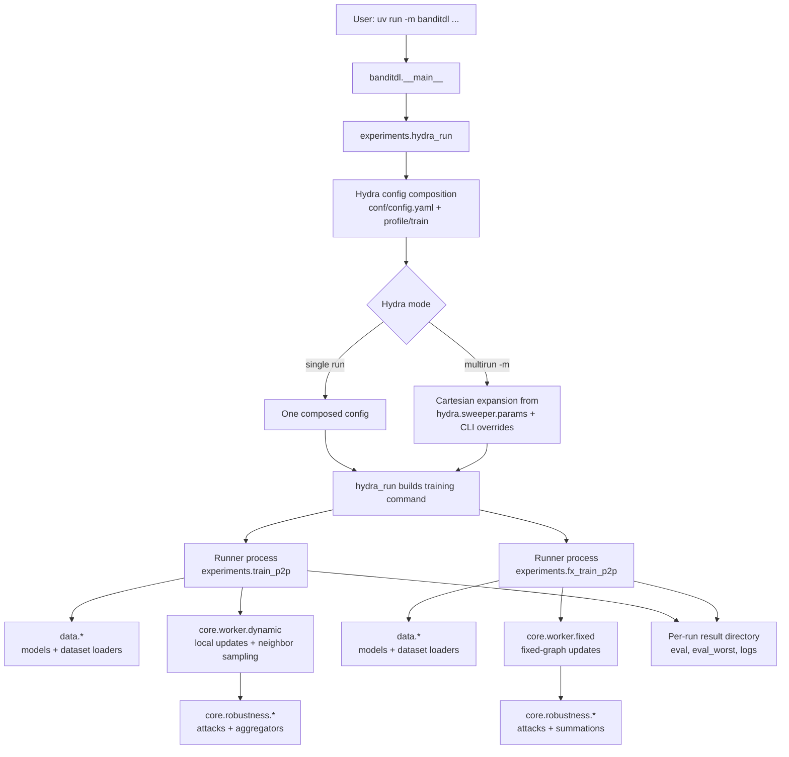
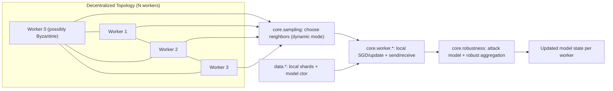

# banditdl

Hydra-multirun experiments for Byzantine-resilient decentralized learning.

## Setup

```bash
uv sync
```

If `uv` cache is not writable in your environment:

```bash
UV_CACHE_DIR=/tmp/uv-cache uv sync
```

## Run One Experiment

```bash
uv run -m banditdl
```

Example overrides:

```bash
uv run -m banditdl profile=mnist_dynamic profile.nb_neighbors=5 profile.byzcount=1 seed=0
```

## Run Sweeps (Hydra Multirun)

Hydra does orchestration. The custom in-repo scheduler is no longer the main path.

### Option A: Preset matrix from profile

Each profile contains its own `hydra.sweeper.params` matrix.

```bash
uv run -m banditdl -m profile=cifar_dynamic
uv run -m banditdl -m profile=mnist_dynamic
uv run -m banditdl -m profile=cifar_fixed
uv run -m banditdl -m profile=mnist_fixed
```

### Option B: Ad-hoc sweep from CLI

```bash
uv run -m banditdl -m \
  profile=mnist_dynamic \
  seed=0,1 \
  profile.nb_neighbors=3,5 \
  profile.attack=ALIE,SF \
  profile.nb_local_steps=1,3
```

## Existing Profiles

- `cifar_dynamic`
- `mnist_dynamic`
- `cifar_fixed`
- `mnist_fixed`

## Hydra Parameters Handled

Top-level:
- `profile` (config group)
- `train` (config group)
- `seed`
- `device`

`profile` fields:
- `mode`: `dynamic` or `fixed`
- `dataset`, `model`, `nb_workers`, `alpha`
- `result_directory`, `plot_directory`
- `byzcount`, `b_hat`
- `nb_neighbors`, `nb_local_steps`
- `attack`, `method`
- `params_common` (forwarded as CLI args to training runner)
- `hydra.sweeper.params` (preset sweep matrix)

`train` fields:
- `train_program`: module path (`train_p2p` or `fx_train_p2p`)
- `neighbor_sampler`: currently `uniform`

Inspect resolved config:

```bash
uv run -m banditdl --cfg job
```

## How To Create A New Experiment

1. Copy a profile in `conf/profile/`.
2. Set scalar defaults for single-run behavior.
3. Add/update `hydra.sweeper.params` in the same profile for preset matrix sweeps.

Example:

```yaml
# conf/profile/my_new_profile.yaml
mode: dynamic
...
hydra:
  sweeper:
    params:
      seed: 0,1
      profile.nb_neighbors: 3,5,7
      profile.attack: ALIE,SF
```

Run it:

```bash
uv run -m banditdl -m profile=my_new_profile
```

## Runtime Architecture

This section describes runtime execution logic and module interactions.

### Runtime Interaction Diagram



### End-to-end Flow

1. You run `uv run -m banditdl ...`.
2. `banditdl.__main__` dispatches to `banditdl.experiments.hydra_run`.
3. Hydra composes config from `conf/`.
4. In multirun mode, Hydra generates one run per parameter combination.
5. For each run, `hydra_run` builds a concrete training CLI command.
6. Training runner (`train_p2p` or `fx_train_p2p`) executes and writes results.

### Responsibilities By Module

- `banditdl.experiments.hydra_run`
  - Hydra-to-runner adapter.
  - Converts composed config into one concrete training command.

- `banditdl.experiments.train_p2p` / `fx_train_p2p`
  - Per-run executables for dynamic/fixed settings.
  - Drive training/evaluation loops and persistence.

- `banditdl.core.worker.*`
  - Worker logic for local updates and communication.

- `banditdl.core.robustness.*`
  - Byzantine attacks and robust aggregation/summation rules.

- `banditdl.data.*`
  - Dataset loading/partitioning and model construction.

- `banditdl.core.sampling`
  - Neighbor sampling strategy used in dynamic worker mode.


### Terminology: Worker = Node

In this repository, a **worker** is one decentralized learning participant (node/client):
- it owns local train/test data loaders,
- performs local optimization steps,
- communicates with neighbors,
- applies robust aggregation logic under Byzantine settings.

So one worker instance corresponds to one simulated node in the decentralized network.

### Decentralized Structure Diagram



Interpretation:
- Each worker is a simulated node with its own local data and model copy.
- Communication is peer-to-peer, not centralized; each node exchanges updates with selected neighbors.
- In dynamic mode, neighbor sets are re-sampled each round (`core.sampling`).
- Received updates pass through Byzantine attack/aggregation logic before updating local state.

## Sampling / Bandit Hook Points

- `banditdl/core/sampling.py`
- `banditdl/experiments/train_p2p.py`
- `banditdl/core/worker/`
